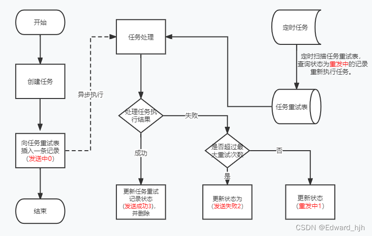

# task-retry-project
It is a task execution failure retry project whose main purpose is to ensure that the task will be executed with a high probability of success
# 背景
一个任务失败重试工程，不仅支持mq消息补偿重发，还支持其他的任务重试补偿，实现100%任务执行成功

# 版本更新日志

| 版本 | 内容 | 更新时间 |
| --- | --- | --- |
| 1.0.0 |项目初始化  | 2023.3.28 |

# 使用场景
1，业务需要保证任务执行成功，并且失败后能间隔一段时间后重推
2，消息不需要顺序消费

# 流程图

# 时序图

# 接入流程
1，数据库脚本：

```
CREATE TABLE `t_sys_mq_resend_log` (
 `id` bigint(20) unsigned NOT NULL COMMENT '主键',
 `project_name` varchar(100) NOT NULL DEFAULT '' COMMENT '项目名，项目名和source唯一确定一个记录',
 `source` int(11) NOT NULL COMMENT '任务来源' ,
 `msg_key` varchar(50) NOT NULL DEFAULT '' COMMENT '任务唯一标识',
 `status` tinyint(4) NOT NULL DEFAULT '0' COMMENT '任务状态 0=执行中 1=重试中 2=任务执行失败 3=任务执行成功',
 `send_count` int(11) NOT NULL DEFAULT '0' COMMENT '重试次数',
 `topic` varchar(255) NOT NULL DEFAULT '' COMMENT '消息topic',
 `context` text COMMENT '消息内容,任务上下文字段',
 `next_send_time` datetime DEFAULT NULL COMMENT '下一次发送时间',
 `create_time` datetime NOT NULL DEFAULT CURRENT_TIMESTAMP COMMENT '创建时间',
 `update_time` datetime NOT NULL DEFAULT CURRENT_TIMESTAMP ON UPDATE CURRENT_TIMESTAMP COMMENT '最后更新时间',
 PRIMARY KEY (`id`),
 KEY `idx_msg_key` (`msg_key`),
 KEY `idx_create_time` (`create_time`),
 KEY `idx_update_time` (`update_time`),
 KEY `idx_search` (`project_name`,`next_send_time`)
) ENGINE=InnoDB DEFAULT CHARSET=utf8mb4 ROW_FORMAT=DYNAMIC COMMENT='任务重试记录表';
```

2，项目pom引入

```
<!--根据实际情况进行调整-->
<dependency>
    <groupId>com.example.common</groupId>
    <artifactId>task-retry-starter</artifactId>
    <version>1.0.0</version>
</dependency>
```

3,配置文件

```
#MQ重试
 必须配置
task-retry:
  enable: true
  job: true

  可选配置：
task-retry:
 task-limit: 50
 task-max-retry: 4
 first-execute-second: 5
 delay-base-second: 10
 delay-multiplier: 10
 thread-pool-param:
    core-pool-size: 10
    max-pool-size: 100
    keep-alive-seconds: 60
    queue-capacity: 1000
```

enable：开关开启,true=开启任务重试功能
job:是否在本项目启动定时任务，如果为false，则需要自己配置定时任务。

task-limit：定时任务每次获取 发送中 状态消息的数量
task-max-retry：定时任务重试次数
first-execute-second：第一次重试的间隔时间
delay-base-second:第二次及以后的重试间隔基数
delay-multiplier：第二次及以后的重试间隔倍数

thread-pool-param:  线程池参数
core-pool-size: 10 核心线程数
max-pool-size: 100 最大线程数
keep-alive-seconds: 60 空闲线程存活时间，s。
queue-capacity: 10000 队列容量

# 使用示例

2种使用方式：一，重试任务为：mq发送消息。二，重试任务为：自定义任务。

1，重试任务为：mq发送消息。

```
@Autowired
ResendContext resendContext;
2，source传Source.ROCKET_MQ=10 即可。 
TaskDTO taskDTO = new TaskDTO();
taskDTO.setSource(Source.ROCKET_MQ);
taskDTO.setTopic("my-topic");
taskDTO.setMsgKey(String.valueOf(20221213660896L));
taskDTO.setContext("objMsg");
resendContext.handlerTask(taskDTO);
```

2,重试任务为：自定义任务。
①实现Source，定义消息来源

```
public enum TaskRetrySourceEnum implements Source {
 DO_TASK(30),
 ;
 private final Integer value;

 TaskRetrySourceEnum(Integer value) {this.value = value;}
 public Integer getValue() { return value;}
}
```
②继承任务重试抽象策略类：AbstractTaskRetryStrategy，重写doHandleTask任务处理方法，和getTaskSource获取任务来源接口

```
@Component
@Slf4j
public class MyTestStrategy extends AbstractTaskRetryStrategy {


 @Autowired
 Manager manager;

 
 @Override
 public int getTaskSource() {
 return TaskRetrySourceEnum.DO_TASK;
 }

 @Override
 public HandleResultDTO doHandleTask(SysMqResendLog sysMqResendLog) {
  doSomething()----
 return HandleResultDTO.builder()
 .result(mqResult ? HandleResultEnum.SUCCESS.getValue() : HandleResultEnum.FAIL.getValue())
 .reason(Objects.isNull(messageSendResult.getE()) ? null : messageSendResult.getE().getLocalizedMessage())
 .sysMqResendLog(sysMqResendLog)
 .build();
 }
```
③，业务场景使用

```
@Resource
ResendContext resendContext;

 TaskDTO taskDTO = new TaskDTO();
 taskDTO.setSource(TaskRetrySourceEnum.DO_TASK);
 taskDTO.setContext("obj");
 resendContext.strategyHandler(taskDTO);

```


# 定时任务配置
如果配置设置task-retry.job=true，项目启动后自动接入xxl-job，需要在xxl-job控制台配置开启生效任务,并配置默认参数“blank”

定时任务：

重发定时任务（taskRetryJob）：
物理删除定时任务（removeHistory）;

# 其他
因为定时任务是定时扫描失败的推送，实际重试时间会受定时任务执行间隔影响，建议将定时任务频率相应调高。